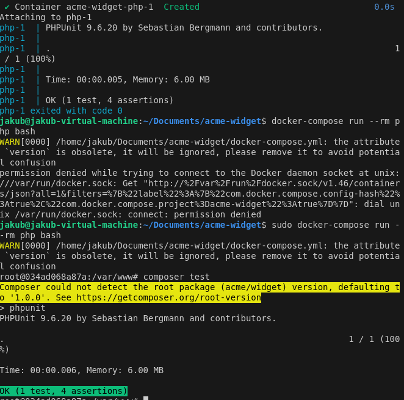

# Acme Widget Co Basket



## Overview

This project is a proof of concept for Acme Widget Co's new sales system. It includes a basket implementation with product catalogue, delivery charge rules, and special offers using PHP with a focus on modern development practices.

## Technologies Used

- **PHP**: The core programming language used for this project.
- **Composer**: For dependency management.
- **PHPUnit**: For unit and integration tests.
- **PHPStan**: For static analysis.
- **Docker**: For containerizing the application.
- **Docker Compose**: For orchestrating Docker containers.
- **Dependency Injection**: To decouple class dependencies.
- **Strategy Pattern**: To handle different types of offers.
- **Sensible types**: Using strict types for better type safety.
- **Source control and code review**: Using Git for version control.
- **Good separation/encapsulation**: Ensuring classes and functions have single responsibilities.
- **Small, accurate interfaces**: Designing clear and concise interfaces for interactions.

## Installation

### Prerequisites

- Docker and Docker Compose should be installed on your system.
- Composer should be installed for dependency management.

### Steps

1. **Clone the repository**:

    ```sh
    git clone <repository_url>
    cd acme-widget
    ```

2. **Install dependencies**:

    ```sh
    composer install
    ```

3. **Build and run the Docker container**:

    ```sh
    docker-compose up --build
    ```

## Project Structure

- `src/`: Contains the source code for the project.
    - `Basket.php`: The main class for handling the basket logic.
    - `Product.php`: Class representing a product.
    - `DeliveryRule.php`: Class for managing delivery rules.
    - `Offer.php`: Interface and implementation of special offers.
- `tests/`: Contains the test cases for the project.
    - `BasketTest.php`: PHPUnit test cases for the Basket class.
    - `bootstrap.php`: Bootstrap file for initializing the testing environment.
- `Dockerfile`: Docker configuration file for building the PHP application container.
- `docker-compose.yml`: Docker Compose configuration for orchestrating services.
- `composer.json`: Composer configuration file for managing dependencies.
- `README.md`: This readme file.

## Usage

The basket can be initialized with a product catalogue, delivery rules, and offers. Products can be added using the `add` method, and the total cost can be calculated using the `total` method.

### Example

```php
$catalogue = [
    'R01' => new Product('R01', 'Red Widget', 32.95),
    'G01' => new Product('G01', 'Green Widget', 24.95),
    'B01' => new Product('B01', 'Blue Widget', 7.95)
];

$deliveryRules = [
    new DeliveryRule(50, 4.95),
    new DeliveryRule(90, 2.95),
    new DeliveryRule(PHP_INT_MAX, 0.00)
];

$offer = new BuyOneGetOneHalfPrice('R01');

$basket = new Basket($catalogue, $deliveryRules, $offer);
$basket->add('B01');
$basket->add('G01');
echo 'Total: ' . $basket->total(); // Should print 37.85
```

## Testing

To test the implementation, you can run the PHPUnit tests inside the Docker container. The `bootstrap.php` file in the `tests` directory initializes the testing environment.

### Running Tests

1. **Run PHPUnit tests**:

    ```sh
    docker-compose run php ./vendor/bin/phpunit
    ```

2. **Run PHPStan for static analysis**:

    ```sh
    docker-compose run php ./vendor/bin/phpstan analyse
    ```

### `bootstrap.php`

The `bootstrap.php` file in the `tests` directory is used to set up the environment for running tests. It can include autoloading necessary classes and any initialization required before running the tests. Here’s an example:

```php
<?php

require __DIR__ . '/../vendor/autoload.php';

// You can include additional setup code here if needed
```

## Assumptions

1. The delivery rules are straightforward and tiered based on the total amount.
2. The special offer currently implemented is "buy one red widget, get the second half price".
3. The product codes in the example are assumed to be valid and available in the catalogue.
